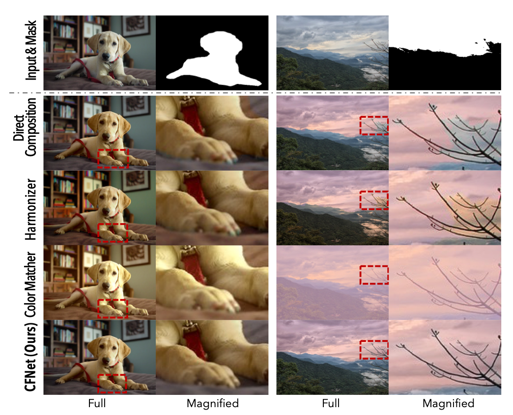

# ChromaFusionNet (CFNet)
Official PyTorch Implementation of AAAI 2024 Paper "[ChromaFusionNet (CFNet): Natural Fusion of Fine-Grained Color Editing](https://ojs.aaai.org/index.php/AAAI/article/view/27925)"



# Environment
Tested on Ubuntu 20.04 + CUDA 11.3
```
conda create -n cfnet python=3.9 -y
conda activate cfnet
pip install torch==1.12.1+cu113 torchvision==0.13.1+cu113 torchaudio==0.12.1 --extra-index-url https://download.pytorch.org/whl/cu113
pip install -r requirements.txt
```

# Checkpoints
Please unzip the following zip file to project's main folder.\

**Google Drive**
```
https://drive.google.com/file/d/1xK23C1k68lKrH0yeLvxKwr3MZ-71RvqM/view?usp=sharing
```


**Baidu Disk**
```
https://pan.baidu.com/s/1iMu2DNmiuTc9vSEafDrpLA?pwd=szz4
Password: szz4 
```


# Inference
```
python inference.py
```

## Acknowledgments

This code repository is partially borrowed from [iColoriT](https://github.com/pmh9960/iColoriT) and [ESRGAN](https://github.com/xinntao/ESRGAN)


# Citation
You can cite it as follows:
```
@article{CFNet_2024,
  title={ChromaFusionNet (CFNet): Natural Fusion of Fine-Grained Color Editing},
  volume={38},
  url={https://ojs.aaai.org/index.php/AAAI/article/view/27925},
  DOI={10.1609/aaai.v38i2.27925},
  number={2},
  journal={Proceedings of the AAAI Conference on Artificial Intelligence},
  author={Dong, Yi and Wang, Yuxi and Fan, Ruoxi and Ouyang, Wenqi and Shen, Zhiqi and Ren, Peiran and Xie, Xuansong},
  year={2024},
  month={Mar.},
  pages={1591-1599}
}
```